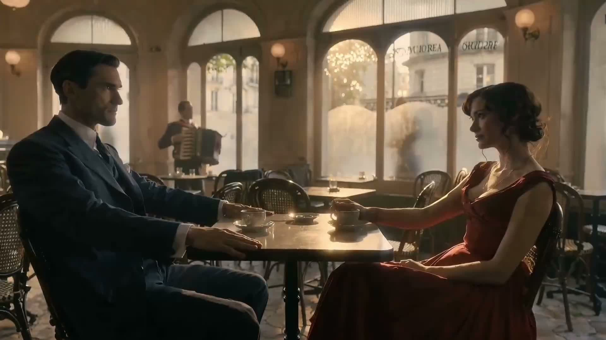
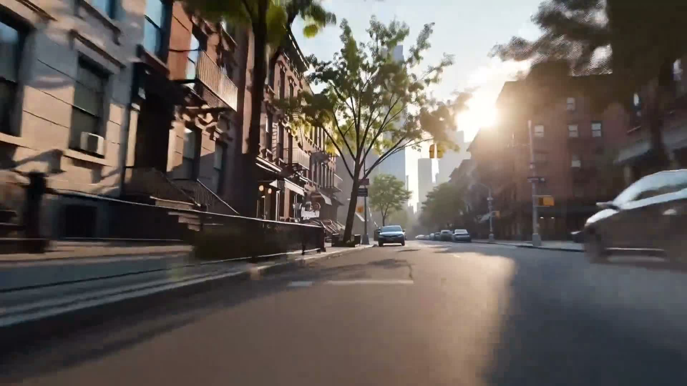
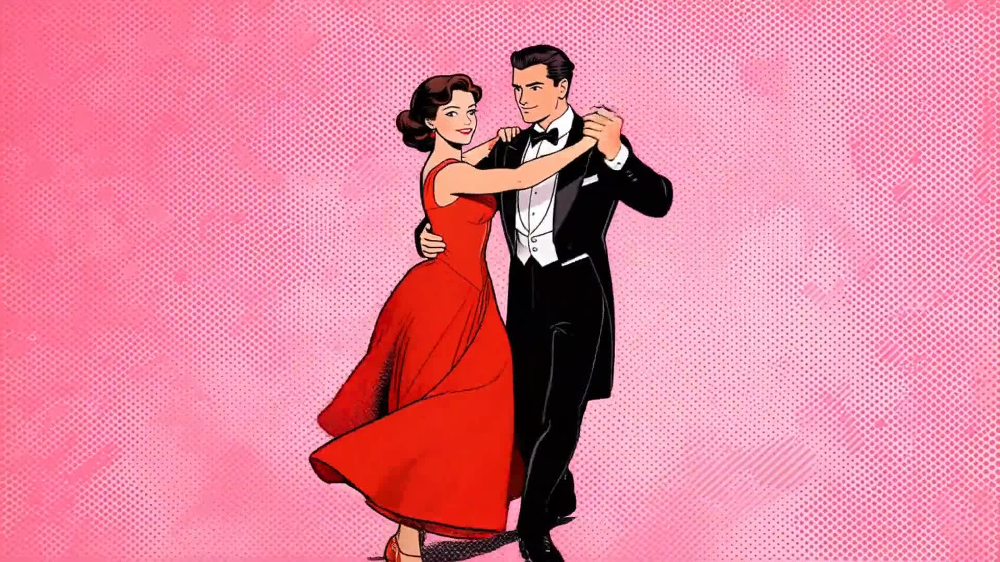
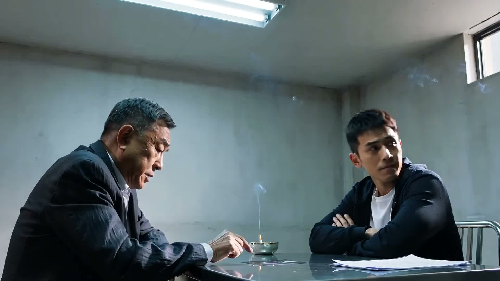
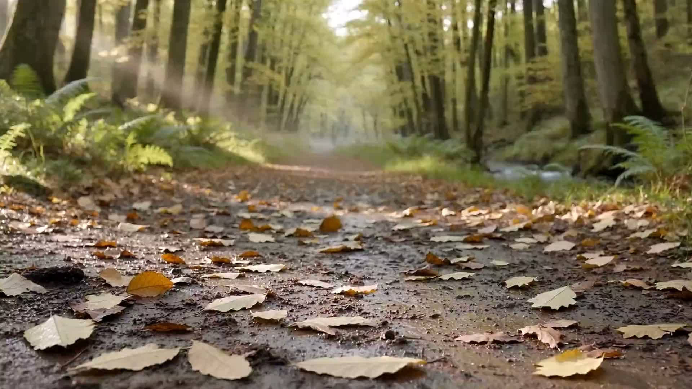
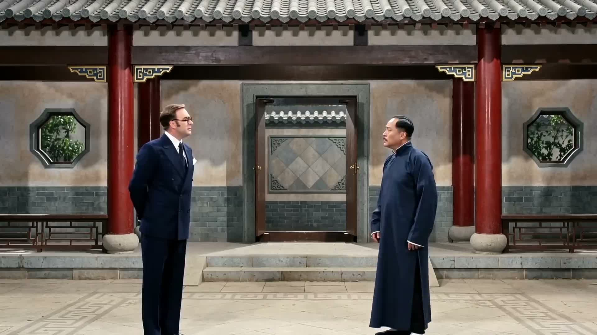
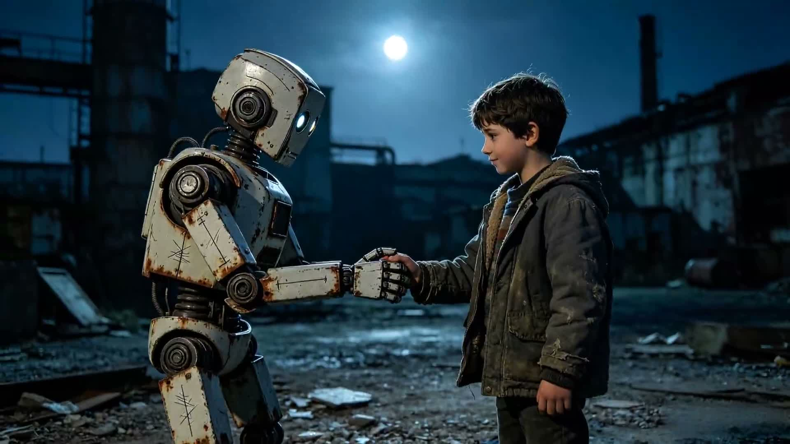
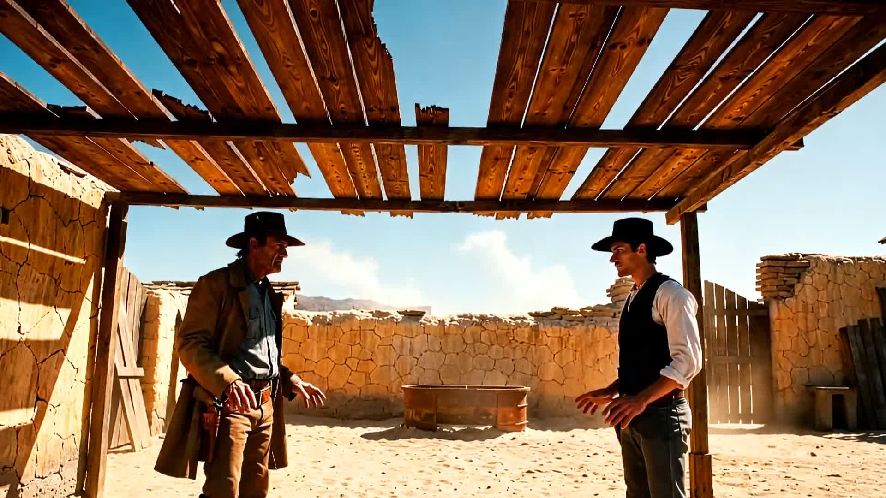

<div align="center">

# Awesome Happy Horse Prompts

Yapay zeka video üretimi için resmi Happy Horse örnekleri ve promptları.

[](README.md)
[](README_es.md)
[](README_pt.md)
[](README_ja.md)
[](README_ko.md)
[](README_de.md)
[](README_fr.md)
[](README_tr.md)
[](README_zh-TW.md)
[](README_zh-CN.md)
[](README_ru.md)

</div>

## 🍌 Giriş

Aşağıdaki örneklerin tamamı resmi örneklerdir.

## 📑 Menü

- [Case 1: Official Example 1](#case-1-official-example-1)
- [Case 2: Official Example 2](#case-2-official-example-2)
- [Case 3: Official Example 3](#case-3-official-example-3)
- [Case 4: Official Example 4](#case-4-official-example-4)
- [Case 5: Official Example 5](#case-5-official-example-5)
- [Case 6: Official Example 6](#case-6-official-example-6)
- [Case 7: Official Example 7](#case-7-official-example-7)
- [Case 8: Official Example 8](#case-8-official-example-8)
- [Case 9: Official Example 9](#case-9-official-example-9)

## Resmi Örnekler

### Vaka 1: Resmi Örnek 1

**Prompt**

```text
A cinematic script scene set in a sun-drenched Parisian café, golden afternoon light spilling through arched windows. A sharp-dressed man in a tailored navy suit sits across from an elegant woman in a flowing crimson dress, half-empty coffee cups between them. The air is thick with unspoken tension. He leans forward, voice low and steady: "You knew from the beginning, didn't you? That none of this was real." She holds his gaze without flinching, a ghost of a smile on her lips, slowly stirring her coffee: "Everything was real. That's exactly what makes it so dangerous."  Cinematic wide-angle composition, warm golden hour lighting, shallow depth of field, film grain texture, muted vintage color palette with deep crimson accents, highly detailed wardrobe and facial expressions, noir romantic aesthetic, emotionally charged atmosphere, European street photography style, dramatic storytelling, 35mm film look.
```

**Video Örneği**

[](videos/b8c827e9-a09a-5d20-9573-9f6ae411f49b/1.mp4)

Video bağlantısı: [videos/b8c827e9-a09a-5d20-9573-9f6ae411f49b/1.mp4](videos/b8c827e9-a09a-5d20-9573-9f6ae411f49b/1.mp4)

### Vaka 2: Resmi Örnek 2

**Prompt**

```text
纽约城市景观·超现实主义FPV一镜到底镜头脚本。镜头从紧贴地面的极低角度猛然弹射而出，沿清晨无人的曼哈顿街头疾速贴地飞行。两侧褐石建筑、红砖楼宇化作流动色块，柏油路面的裂缝折射晨光，偶尔掠过的铸铁护栏、街头消防栓留下模糊残影。摄像机保持离地30厘米，每秒数米冲刺，轻微横向摇摆模拟手持呼吸感，悬铃木枝叶间隙的晨光形成连续光斑扫掠，落在复古的金属门牌号上。接近街角Bagel店时，镜头减速滑行、缓缓抬升，以弧线绕过第一张金属折叠桌，不锈钢面包篮的纹路掠过画面边缘。推进至Bagel店摊位深处，运动转为慢动作凝滞，以毫米级速度爬行，围绕悬浮的水流形成的文字 “HappyHorse 1.0”、冰美式咖啡、《纽约邮报》、Bagel面包等物品。镜头推至文字前方 15 厘米处静止凝视，液态文字微微涌动。瞬间，文字爆裂成无数水珠，摄像机被气浪猛推，急速后拉并向下俯冲，轨迹呈剧烈J形转折。镜头以自由落体砸向地面，触地前一帧再次突变，贴地超低空滑行，视角侧倾近 90度，右侧红砖建筑立面垂直耸立，街头黄色出租车的轮胎在视野边缘飞速后退。滑行两秒后，镜头向上弹射，沿曼哈顿摩天大楼（帝国大厦旁）外墙垂直爬升，仰角从水平转为垂直向上，玻璃幕墙反射的晨光形成连续光带，映出远处自由女神像的剪影。爬升至屋顶高度，外翻越过天台围栏，空中完成180 度轴向翻转，从仰望天空转为俯视深渊，沿世贸中心双子塔遗址周边高楼间的狭窄天井垂直下坠。下坠初始速度适中，镜头朝下稳定俯拍，天井四壁如方形画框向中心收缩，下方第五大道的车流化作彩色光轨。速度逐渐加快，镜头加入左右摆动，时而贴近布鲁克林红砖建筑擦过复古空调外机，时而摆向写字楼混凝土横梁，轨迹呈失控螺旋下坠。每经过一层平台，镜头随机偏转，仿佛被气流撞击，在狭窄空间中不断反弹、修正、偏离，偶尔掠过悬挂的霓虹招牌与街头涂鸦。下坠至中段，光线急剧衰减，虚拟暗光增强捕捉到老旧楼宇剥落的墙面、锈蚀的消防管道、杂乱的电缆。镜头开始沿光轴 360 度连续翻滚，天井四壁（一边是现代玻璃幕墙，一边是布鲁克林红砖墙）化作旋转的红与银的漩涡，偶尔闪现的Bagel店暖光、街头路灯如深渊中的孤岛。接近底部最后十米，速度极限，旋转平息，镜头重新垂直俯冲。即将撞击地面的瞬间，穿透无形镜面，重力方向倒置—从向下俯冲无缝切换为向上浮升，轨迹呈现莫比乌斯环式转折。进入镜像世界，镜头保持向前惯性，在倒置的纽约上空水平滑行。布鲁克林褐石屋、曼哈顿公寓屋顶群在脚下绵延至天际线，天空被踩在上方，两名倒悬的街头咖啡师（手持咖啡壶、吆喝声仿佛从天际传来）缓缓飘过。镜头优雅穿梭于漂浮的纸杯咖啡、牛皮纸袋与Bagel之间，做小幅升降起伏，围绕玻璃球缓慢椭圆运动，最终平稳直线推进，缓缓贴近玻璃球表面—球体中倒映的无限递归城市景观（第五大道、帝国大厦、布鲁克林大桥交织）逐渐填满画面，速度降至每秒不足一厘米，在绝对静止中淡出至纯白。
```

**Video Örneği**

[](videos/c4d76aee-4ef7-5dcb-8d96-fa436aab16ba/1.mp4)

Video bağlantısı: [videos/c4d76aee-4ef7-5dcb-8d96-fa436aab16ba/1.mp4](videos/c4d76aee-4ef7-5dcb-8d96-fa436aab16ba/1.mp4)

### Vaka 3: Resmi Örnek 3

**Prompt**

```text
跳舞，转了一圈后，从卡通变成现实场景。
```

**Video Örneği**

[](videos/530318cf-4e9a-5acd-ba2a-08aa56e701cd/1.mp4)

Video bağlantısı: [videos/530318cf-4e9a-5acd-ba2a-08aa56e701cd/1.mp4](videos/530318cf-4e9a-5acd-ba2a-08aa56e701cd/1.mp4)

### Vaka 4: Resmi Örnek 4

**Prompt**

```text
【场景】冷白灯光打下的审讯室，金属桌面反光，烟灰缸里还有未熄的烟。 【主体】左侧【老刑警】西装褶皱，眼袋深重，手指慢慢敲着桌面；右侧【嫌疑人】双臂交叉，眼神游移，嘴角带着一丝不易察觉的轻蔑。 【运动】老刑警将一张照片缓缓推过桌面，嫌疑人眼神微微一顿又迅速移开；镜头低角度平推，捕捉两人手部与表情的细微对峙。 【音频】[老刑警，语速极慢，每个字像钉子]："你知道我做这行多少年了吗。" [短暂沉默，烟灰缸上的烟细细飘散] [嫌疑人，轻飘飘，刻意漫不经心]："跟我有关系吗。" [老刑警，不抬头，嘴角微动]："有。因为我从没输过。"
```

**Video Örneği**

[](videos/d44554f0-2391-5e00-a00d-e80dce66a7f4/1.mp4)

Video bağlantısı: [videos/d44554f0-2391-5e00-a00d-e80dce66a7f4/1.mp4](videos/d44554f0-2391-5e00-a00d-e80dce66a7f4/1.mp4)

### Vaka 5: Resmi Örnek 5

**Prompt**

```text
清晨的山林小路上，镜头缓慢推进，一双鞋踩在略微潮湿的泥土和落叶上，发出轻微而清脆的“沙沙”声。周围只有微风吹过树叶的“簌簌”声，偶尔传来几声清脆的鸟鸣，远处还能听到溪水流动的细小水声。整段画面强调山林环境的安静、湿润和自然回响，环境音真实细腻。
```

**Video Örneği**

[](videos/d44554f0-2391-5e00-a00d-e80dce66a7f4/1.mp4)

Video bağlantısı: [videos/d44554f0-2391-5e00-a00d-e80dce66a7f4/1.mp4](videos/d44554f0-2391-5e00-a00d-e80dce66a7f4/1.mp4)

### Vaka 6: Resmi Örnek 6

**Prompt**

```text
请给我生成一段邵氏风格喜剧电影，欧美男士说中文，中国男人说英文。
```

**Video Örneği**

[](videos/c41fdcb5-76d4-5559-9d19-0c5bfb27b5ab/1.mp4)

Video bağlantısı: [videos/c41fdcb5-76d4-5559-9d19-0c5bfb27b5ab/1.mp4](videos/c41fdcb5-76d4-5559-9d19-0c5bfb27b5ab/1.mp4)

### Vaka 7: Resmi Örnek 7

**Prompt**

```text
A boy and the rusty robot stand under the cool glow of the full moon, gently holding hands with a deep bond; a tight close-up captures the boy looking sincere and kind, his lips moving softly to whisper, "we are friends"; the robot's luminous eyes flicker and pulse as it processes the message, responding in a stuttering, mechanical electronic voice, "we... are, we... are friends"; hearing this, the boy's expression lights up with pure joy, and he reaches out his hand to kindly stroke and pat the robot's weathered metal head; the camera pulls back to a wide shot.
```

**Video Örneği**

[](videos/789a0d19-f20a-542e-85ba-df3c84bcb3e2/1.mp4)

Video bağlantısı: [videos/789a0d19-f20a-542e-85ba-df3c84bcb3e2/1.mp4](videos/789a0d19-f20a-542e-85ba-df3c84bcb3e2/1.mp4)

### Vaka 8: Resmi Örnek 8

**Prompt**

```text
Cinematic western standoff. A sun-bleached desert outpost with wind whistling through cracked, weather-beaten wooden slats. Two cowboys stand in a tense, physical confrontation, facing each other with hands hovering tensely over their holsters. In the far distance, dust devils dance across the shimmering, heat-distorted horizon. Extreme close-ups capture the sweat on their brows, the grit of their skin, and the subtle, rhythmic trembling of their fingers near the gun belts. The dialogue plays out in the tension: The older cowboy spits on the ground, 'You kept your word.' The younger one replies sharply, 'I kept my promise.' The older man narrows his eyes, 'The price is too high.' The younger one looks him straight in the eye, 'It’s my price to pay.' The older man exhales, 'Then draw.' The younger one whispers, 'As you wish.' The aesthetic is gritty and Leone-inspired, featuring sharp high-contrast visuals, a palette of sepia and burnt orange, deep dramatic shadows, 35mm film grain, and a heavy, thick atmosphere of impending violence.
```

**Video Örneği**

[](videos/6c956350-3907-5b08-8ef2-2db05658079d/1.mp4)

Video bağlantısı: [videos/6c956350-3907-5b08-8ef2-2db05658079d/1.mp4](videos/6c956350-3907-5b08-8ef2-2db05658079d/1.mp4)

### Vaka 9: Resmi Örnek 9

**Prompt**

```text
【场景】奢华的私人飞机机舱内，窗外是壮丽的金红色的云海落日，阳光将机舱渲染成琥珀色。【主体】左侧满头银发的 [ 年长男性 ] 身穿高定西装，手持威士忌酒杯，目光如鹰般锐利；右侧的 [ 年轻男性 ] 身体微微前倾，眉头微皱，神情既紧张又充满野心。【运动】年长男性轻轻晃动着手中的酒杯，液体挂壁，他身体逼近对方；年轻男性深吸一口气，眼神坚定地回视。镜头缓慢侧推，聚焦两人之间紧绷的张力。【音频】[ 年长男性, 低沉沙哑, 充满威严 ] 说道：“In this world, you either hunt or you become the prey. Which one are you?”  [ 年轻男性, 嗓音紧绷但坚定 ] 回答：“I am the one who pulls the trigger.” 背景伴随着飞机引擎深沉的轰鸣声和冰块撞击玻璃杯的清脆声。
```

**Video Örneği**

[](videos/a299ba5e-e0e2-575b-8b4e-c387993c3c6f/1.mp4)

Video bağlantısı: [videos/a299ba5e-e0e2-575b-8b4e-c387993c3c6f/1.mp4](videos/a299ba5e-e0e2-575b-8b4e-c387993c3c6f/1.mp4)

---

OpenClaw tarafından güncellendi
